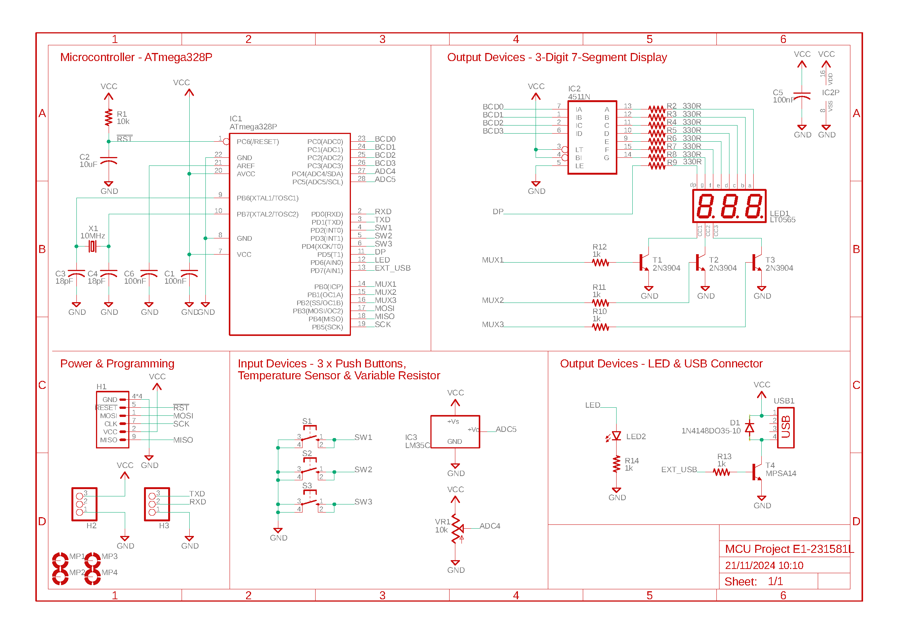
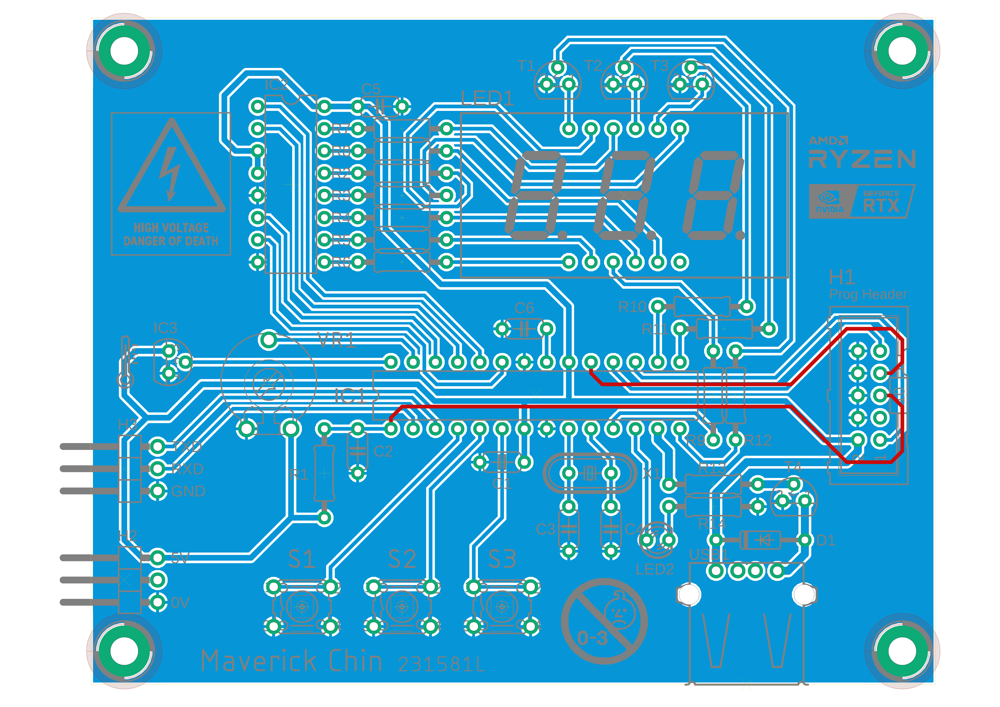
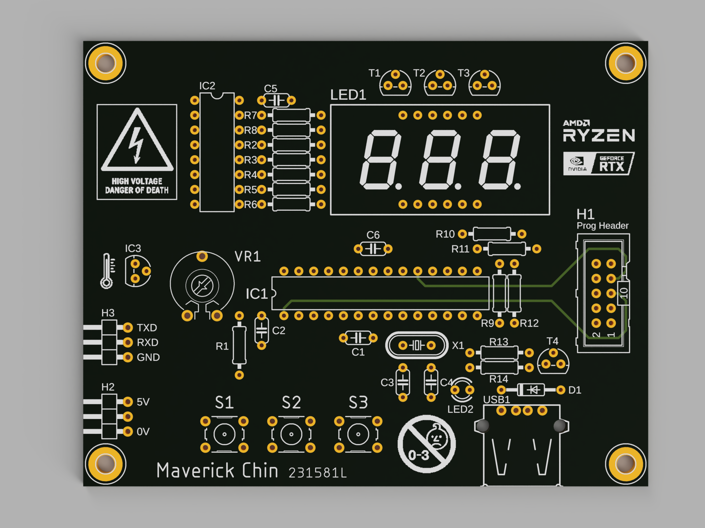

## Project Overview
This project was about designing a project board for the [ATMega328P](https://www.microchip.com/en-us/product/atmega328p) microcontroller from Microchip Technology (formerly Atmel Corporation), a legendary 8-bit AVR microcontroller due to its use in the ubiquitous open-source Arduino boards (Uno R1-R3). The project board is to be printed eventually as well.

## Board Features

### Inputs and outputs
- PT-10 (10mm) carbon potentiometer
- LM35C board mount temperature sensor
- 3x Omron B3F (6mm x 6mm) tactile switches
- A 3-digit seven-segment display driven by a 4511N, multiplexed using 2N3904 NPN BJTs
- LED (3mm) indicator light

### Connections
- UART/USART header
- 5V header
- Programming header with SPI and RST
- USB-A power-only port

## Designing the PCB
The project was part of an NYP module called the "Electronic Systems Design Project". A base schematic was given, but we were required to perform calculations before arriving at the resistor values (E12 and E24, [E series](https://en.wikipedia.org/wiki/E_series_of_preferred_numbers)).

### Schematic capture
Autodesk EAGLE was used for the project.

  
  
ATMega328P project board schematic.

### PCB routing
The project required that we minimise the number of traces on the top layer.

Besides following the Design Rule Check, routing was done with attention to:
- Trace and component symmetry when possible and appropriate
- Minimising trace length of:
  1. Decoupling capacitor to pin for reducing inductance and resistance
  2. VCC power rail to component for reducing noise and interference
  3. Crystal oscillator to XTAL1 and XTAL2 for signal integrity
- Tactile switch placement for ergonomics

### Silkscreen
Special care was given to the silkscreen:
- Prioritised alignment with the component
- Ensured no collision with pads
- Made the designators for the switches larger for comfortable reading
- Included a few (humorous) images for good measure

## Final Results

  
  
ATMega328P project board routing and ground plane pour. (Blue: Bottom layer, Red: Top layer)

  
  
3D render of the ATMega328P project board with Autodesk Fusion.

