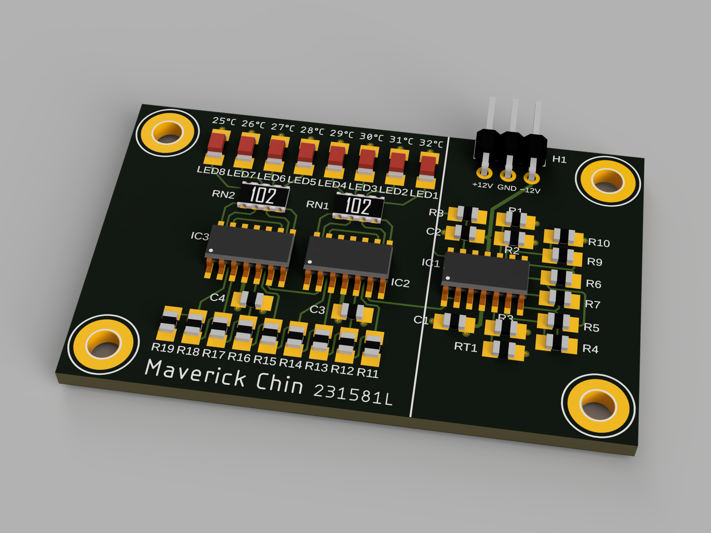

## Project Overview
This project was about designing a thermometer board based on operational amplifier circuits (utilising the LM324 IC), using LEDs as temperature indicators. 

## Designing the PCB
The project was part of an NYP module called the "Electronic Systems Design Project". The operational amplifier circuits we were to use were given, but we were required to perform calculations before arriving at the resistor values (E24, [E series](https://en.wikipedia.org/wiki/E_series_of_preferred_numbers)).

### Circuit design
The temperature sensing device used was an NTC (Negative Temperature Coefficient) thermistor.

VRT1 and VREF are voltages output from separate voltage divider circuits. VRT1 varies with respect to the resistance of the thermistor (determined by temperature), and VREF being fixed.

The differential voltage between VRT1 and VREF is amplified using an instrumentation amplifier circuit and fed into a voltage buffer.

The resulting amplified differential voltage is then visualised by use of 8 LED indicator lights. The amplified differential voltage is fed into a comparator array, where the comparators compare its value to a voltage output by a voltage ladder. This type of ADC (Analog to Digital Converter) is known as a [Flash ADC](https://en.wikipedia.org/wiki/Flash_ADC).

### Schematic capture
Autodesk EAGLE was used for the project. Note that the resistor values shown are placeholder values and should not be used.

  
  
Op-amp thermometer board schematic, sheet 1/2.

  
  
Op-amp thermometer board schematic, sheet 2/2.

### PCB routing
The board was to be a 4-layer board, with a Top, Ground, Power, and Bottom layer in order. Additionally, it was required that we minimise the number of traces on the bottom layer.

Great care was taken regarding component placement and pinswaps and gateswaps were done. No bottom traces were needed.

The design allows for exceptionally easy scaling of the precision or range of the temperature indicators, as it is simple to add more LM324 ICs, resistors, and LEDs.

## Final Results

  
  
Op-amp thermometer board routing. The power and ground planes are not shown.

  
  
3D render of the op-amp thermometer board with Autodesk Fusion.

## Additional 3D rendering

3D rendering a PCB helps prevent collisions and ensures a precise fit to enclosures. However, more effort has to be put into making sure that every component has an appropriate 3D package associated with it.

  
  
3D render of the op-amp thermometer board (with components) with Autodesk Fusion.

