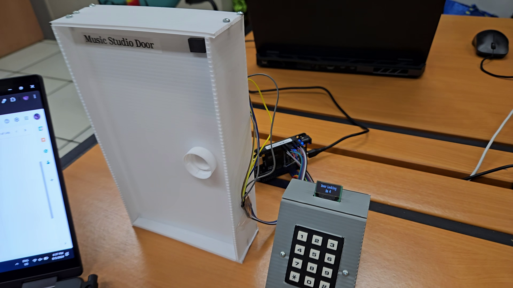
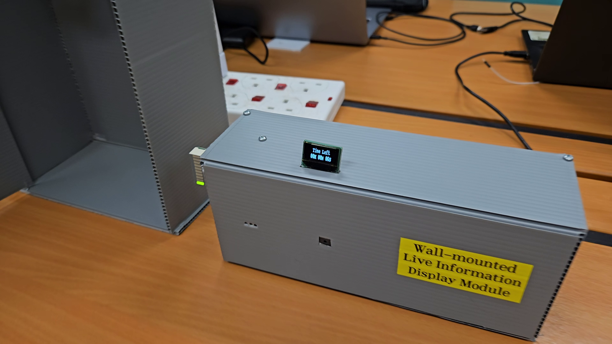
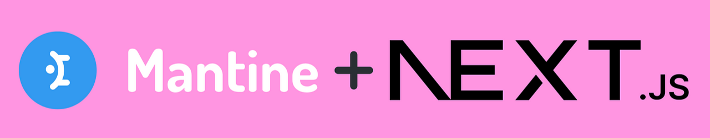

<a href="https://github.com/mavcyh/ege205-group-3-soundspace" target="_blank" class="inline-flex items-center no-underline">
<svg xmlns="http://www.w3.org/2000/svg" viewBox="0 0 24 24" class="h-10 w-10" slot="icon">
<path
    fill="currentColor"
    d="M12 2C6.477 2 2 6.477 2 12c0 4.418 2.865 8.167 6.839 9.491c.5.092.682-.217.682-.482v-1.69c-2.782.603-3.369-1.342-3.369-1.342c-.454-1.153-1.11-1.46-1.11-1.46c-.907-.62.068-.607.068-.607c1.003.07 1.531 1.031 1.531 1.031c.892 1.529 2.341 1.088 2.91.832c.092-.647.35-1.088.636-1.338c-2.22-.253-4.555-1.11-4.555-4.937c0-1.09.39-1.981 1.03-2.678c-.104-.253-.447-1.27.098-2.646c0 0 .84-.269 2.75 1.023c.798-.222 1.653-.333 2.503-.337c.85.004 1.705.115 2.503.337c1.91-1.292 2.75-1.023 2.75-1.023c.545 1.376.202 2.393.098 2.646c.64.697 1.03 1.588 1.03 2.678c0 3.837-2.337 4.682-4.563 4.93c.36.309.678.92.678 1.854v2.749c0 .269.18.58.688.48C19.135 20.165 22 16.417 22 12c0-5.523-4.477-10-10-10z">
</path>
</svg>
<span class="pl-2 text-xl">View this project's Github repository</span>
</a>

## Project Overview
This project aims to contribute to creating more livable cities by addressing challenges faced by both music enthusiasts and studio rental companies.

Music is a universal passion, enjoyed by people from all walks of life. Beyond listening, many love playing—whether it’s jamming with friends or rehearsing with bandmates for gigs. However, access to music studios is often limited, as many are not open 24/7, and available slots are frequently late at night. Moreover, the quality of instruments can be inconsistent due to maintenance issues and user damage, leaving customers frustrated and often willing to pay more for better options.

For music studio rental companies, the challenges are equally significant. High costs of renting spaces, purchasing, and maintaining instruments squeeze financial margins. Many studios lose out on potential revenue during late-night hours due to the lack of manpower to manage operations. Additionally, varying customer needs and fluctuating instrument usage make it difficult to implement cost-effective preventive maintenance, often forcing studios to rely on reactive measures that reduce customer satisfaction.

**SoundSpace** offers a comprehensive hardware and software solution to tackle these challenges. It enhances the experience for both customers and studio owners, providing a seamless, efficient, and customer-focused approach to music studio management.

### Highlight features
**For customers:**
- Easy-to-use real time online booking system
- Ability to pick specific instruments to rent
- Automated entry using a temporary password

**For studio owners:**
- Admin dashboard to view music studio activity
- Efficient preventive maintenance implementation to improve customer satisfaction
- Security system to prevent loitering
- Volume detection system to minimise excessive noise (and thus complaints)
- Drop detection for bulky instruments

### Hardware
<div class="relative w-full">

  
  <p class="text-center mt-[-24px] italic">Music studio door and keypad for access.</p>
</div>
<div class="relative w-full">

  
  <p class="text-center mt-[-24px] italic">Instrument lockers with presence detection.</p>
</div>
<div class="relative w-full">

  
  <p class="text-center mt-[-24px] italic">Wall-mountable module for displaying information about the session.</p>
</div>
<div class="relative w-full">

  
  <p class="text-center mt-[-24px] italic">Wall-mountable module for activity detection and device drop damage checking.</p>
</div>

### Admin dashboard
<div class="relative w-full">

  
  <p class="text-center mt-[-24px] italic">Admin dashbaord for real-time monitoring and event tracking.</p>
</div>

### Demo Video
<div class="relative pb-[56.25%] h-0 overflow-hidden rounded-lg">
  <iframe
    src="https://www.youtube.com/embed/9HySnrrDjzM"
    class="absolute top-0 left-0 w-full h-full"
    frameborder="0"
    allow="accelerometer; autoplay; clipboard-write; encrypted-media; gyroscope; picture-in-picture"
    allowfullscreen
  ></iframe>
</div>

## Full Development Journey
I'll be taking you through the development journey start to finish, and showing you what I'd learnt. Sit back, it's a long one.

### My role
The project was for a module in my course at NYP called the "Connected Systems Design Project". It required my team to create a connected system using embedded devices, a server, and web interface to solve a problem that would contribute to one of three themes: Green, Sustainability, Livability.

We brainstormed, but eventually settled on an idea that I had conceived to improve livability, which is none other than the idea right here. Having conceived the idea, I took the role of project lead.

In the end, I would be in charge of laying the foundations of the project, deciding which technologies and frameworks we would be using, assigning team members roles based on their strengths, making sure that work was done on time, and helping them out whenever issues arose.

### Embedded device and modules

The embedded devices provided were [Beaglebone® Black Wireless Boards](https://www.beagleboard.org/boards/beaglebone-black-wireless), coming with a reasonably powerful Octavo Systems OSD3358 (1Ghz ARM® Cortex-A8) and Texas Instruments WL1835MOD for wireless connectivity. The [Cloud9 IDE](https://aws.amazon.com/cloud9/) was used to program the boards via USB.

Cloud9 was not enjoyable to use: the interface was outdated and there was no sense of any IntelliSense, making code editing painful on the eyes. Even Amazon has decided to stop updating Cloud9 effective July 25 [^1].

[^1]: https://aws.amazon.com/blogs/devops/how-to-migrate-from-aws-cloud9-to-aws-ide-toolkits-or-aws-cloudshell/

On the other hand, the BeagleBone running a full-fledged Linux OS (Debian) meant that native Python code could be run from the Cloud9, meaning that almost all Python libraries could be used: which was amazing.


The BeagleBone was installed with a [mikroBUS Cape](https://www.mikroe.com/beaglebone-mikrobus-cape), which allowed the use of [Mikroe Click Boards™](https://www.mouser.sg/new/mikroe/mikroelektronikaClick/) for rapid prototyping. There is a plethora of Click Boards, 1700+ at the time of writing, ranging from sensors to modules to output devices. I was lucky enough to be provided with the Click Boards as they can be quite expensive as a result of their convenience (14 USD for the [BUZZ 2](https://www.mikroe.com/buzz-2-click) Click Board, compared to ~2 SGD for an active buzzer).

### Back-end
A back-end server was needed to send/ receive data from the BeagleBones, as well expose API endpoints to the front-end server. It would be the brains of the entire system in a sense.


#### A tech stack decision
For small-scale projects, [Flask](https://flask.palletsprojects.com/en/stable/), a web framework written in Python which we had been taught, could suffice as both the back-end server and front-end server. However, it would mean that we wouldn't be able to make use of modern UI libraries, making it harder to build an aesthetically pleasing website and time-consuming to create a booking system from scratch. So, it was decided that we would have a dedicated front-end server consume Flask's API endpoints. I would later find out that [Flask-RESTX](https://flask-restx.readthedocs.io/en/latest/), the library we were using to create API endpoints, automatically generated Swagger API documentation, which was really helpful for development across our cross-functional team.

#### Database
To dhere to best development practices and avoid the _shame_ of using Python dictionaries as data storage, I pitched for the team to use [SQLAlchemy](https://www.sqlalchemy.org/), an Object-Relational Mapper (ORM) to connect to an SQLite database. This proved helpful later when it came to integrating the back-end and front-end of the system with regards to debugging and ease-of-use, with VSCode extensions enabling visualisation of the database.

#### Communication with BeagleBone
To communicate with the BeagleBones, [Socket.IO](https://socket.io/) was used to provide low-latency, bi-directional communication.

### Front-end

From the start of the project, I had already known that I wanted the website to look clean and modern. People's first impression websites dictate how they interact with your businesses[^2], and I wanted to put care and effort here as well, although not as important for our course module.
[^2]: https://research.google/pubs/the-role-of-visual-complexity-and-prototypicality-regarding-first-impression-of-websites-working-towards-understanding-aesthetic-judgments/

#### Next.js
Looking at the popularity of different web frameworks[^3], [Next.js](https://nextjs.org/) was the obvious choice. It was the second most popular web framework after React, but had everything React had and more. For development, its Pages Router was incredibly helpful in managing pages intuitively. Native Server-Side Rendering (SSR) made our pages blazingly fast to load.
[^3]: https://survey.stackoverflow.co/2024/technology

#### Mantine
We're in an engineering course, not a design course! To make our website look good, I knew using a UI library would help us massively, even if it constricted us a little. There were many options, with really popular ones like the _OG_ Bootstrap and Material UI. However, I pitched for the team to use [Mantine](https://mantine.dev/) as it looked much more unique then the two aforementioned, while having detailed API documentation (which was important for the team members who needed to learn it).

### Block Diagram
<div class="relative w-full">

  
  <p class="text-center mt-[-24px] italic">Block diagram of system: note that there can be more than one locker.</p>
</div>

### Problems and hardships
Knowing Murphy's Law, which states:
> Anything that can go wrong will go wrong.

Completing this relatively complex project wasn't going to be smooth sailing.

```
└── 📁flask_app
    └── 📁api
        └── models.py
        └── routes.py
    └── 📁core
        └── core.py
        └── mailer.py
    └── 📁database
        └── crud.py
        └── models.py
    └── 📁socketio_events
        └── bbbw.py
        └── nextjs.py
    └── __init__.py
```
<p style="text-align: center; font-style: italic;">Folder structure of the Flask server</p>
I led my team to experiment with modularization, helping with separation of concerns. However, this quickly led to the first small problem:

#### Circular imports
When the file structure becomes more complex and modules need to start importing other modules, circular imports start to pop up.
```
ImportError: cannot import ... from partially initialized
module ... (most likely due to a circular import)
```
Both direct and indirect circular dependencies can occur, with the latter being when _a_ imports _b_, which imports _c_ which imports _a_. Terrifying.

Thus, an \_init_.py file was needed to help centralise the imports, something not needed for many projects. It meant that the structure of the project had to be well planned out, knowing which functions shoud go where and how they should be called to prevent further circular imports. However, this approach made managing the codebase smoother and more efficient, reducing the need for constant scrolling.

#### Hidden incompatibility
The server was not fully event-driven, requiring additional complexity due to the need for scheduling and timing logic to manage the opening and locking of doors/instrument lockers based on bookings in the database and the current time. This added a layer of responsibility beyond reacting to real-time events, as it needed to actively monitor and execute scheduled tasks.

We were to use [eventlet](https://eventlet.readthedocs.io/en/latest/) as the asynchronous mode for our Flask server, an absolutely ancient, retiring library that tells its users not to use it for new projects. For scheduling of tasks, I opted to use [APScheduler](https://apscheduler.readthedocs.io/en/3.x/) (Advanced Python Scheduler), which was a powerful tool to have on hand.

Most of the testing was done with Flask in debug mode, allowing automatic reloading and providing a debugger. Everything worked reasonably well until it came to run everything on a production server: the Socket.IO messages were timing out, meaning that the BeagleBones did not receive the messages at all, almost driving the project to failure. To make it worse, it would work spontaneously, meaning the problem was going to be hard to find.

After researching on it, I narrowed down the main reason to be an [incompatiblity](https://stackoverflow.com/questions/40544989/sending-python-socket-io-message-from-an-apscheduler-job-causes-client-to-hang) between Socket.IO and APScheduler, due to them both using [greenlets](https://greenlet.readthedocs.io/en/latest/), which can be thought of as lightweight threads. However, some form of scheduling was still needed, as the system would never function properly without it.

Around 3 days were spent trying to find a solution, and I had to explore many new things, not limited to:
- Using different scheduling libraries: schedule and cron, which did not work as well
- How threading in Python worked
- Monkey patching
- Learning how Socket.IO works under the hood (ping/pong, timeouts)

I will not lie, I've forgotten what solution came out in the end: but after those days of stress and constant research, the server finally worked consistently again. Bless StackOverflow and ChatGPT.

#### Datetimes
Handling datetimes was far more tedious than first expected. Data about the booking which the user created, which was in one format ([more specifically, the non-optimal format that our UI library's datepicker was using](https://github.com/orgs/mantinedev/discussions/3307)), had to be passed to our Flask server and processed in another format, before being passed to our SQLite database which then stored it in... you guessed it, another format.

Handling datetime format conversions and timezones required a significant amount of code, which led to various bugs, such as incorrect formats and mismatched timezones. Although these issues were eventually resolved, the experience reinforced for me the importance of thorough project planning from the outset.

#### Prototyping
While the Mikroe Click Boards were great for rapid prototyping, as mentioned earlier, they weren't great for... prototyping, when you had to construct the actual models, downscaled or not. Although the mikroBUS Cape made them plug and play, trying to put them in any meaningful position in the prototype meant cables. A lot of cables.

Trying to position the Click Boards was difficult too. Their pin headers which stuck out the back and needed to be connected, made it difficult to either use Blu-Tack or tape to attach them.

I also wanted to make sure that I didn't use any hot glue on the Click Boards themselves: they were expensive and to be reused, so I eventually decided on designing custom press-fit for each Click Board for each hardware device. This pushed my design skills and took almost the entire workweek, but I'm very happy with how it turned out in the end.
<div class="relative w-full">

  
  <p class="text-center mt-[-24px] italic">The amount of wiring and custom press-fit designs needed for just 4 Click Boards.</p>
</div>
<div class="relative w-full">

  
  <p class="text-center mt-[-24px] italic">Additional: The compact Room & Device Monitoring Module fits an entire BeagleBone in it!</p>
</div>

### Takeaways
This project was probably the _most difficult_ project I had undertaken until that point and really pushed me. I had to learn new languages, libraries, and concepts and utilise them quickly: the project, excluding the research stage was completed in _less than a month_.

However, it's ended up being one of the most fufilling; I felt a great sense of accomplishment after completing it with my team. It's grown my interest in web development, both in the back-end and front-end. It's opened up my eyes (slightly!) to how the websites I view everyday tick. It's taught me how to utiilise open-source embedded development boards to prototype. It's taught me much more that I can't even list it all here, and I am grateful to have been able to finish it, and finish it well.

Till the next time!