<a href="https://www.hackster.io/513079/wings-of-sustainability-bsf-rearing-f94004" target="_blank" class="inline-flex items-center no-underline">
<svg xmlns="http://www.w3.org/2000/svg" viewBox="0 0 24 24" class="h-10 w-10" slot="icon">
<path
  fill="currentColor"
  d="M19.091 13.294c-.057.05-.247.09-.396.132l-4.778 1.306c-.15.041-.273-.052-.273-.208V13.29a.282.282 0 0 0-.283-.283H8.117a.282.282 0 0 1-.282-.282V11.29a.283.283 0 0 0-.283-.283H5.035c-.1 0-.18-.08-.18-.178 0-.058.025-.098.055-.126.056-.052.246-.093.397-.134l4.758-1.3c.15-.042.272.051.272.208v1.247c0 .156.128.283.284.283h5.24c.156 0 .282.126.282.283v1.42c0 .157.127.284.282.284h2.542a.18.18 0 0 1 .18.179.158.158 0 0 1-.056.12m-2.948 2.288a.39.39 0 0 1-.272.356l-1.954.534c-.15.042-.273-.052-.273-.208v-.728c0-.157.127-.284.283-.284h1.933c.157 0 .283.127.283.284zm-5.81 1.586a.39.39 0 0 1-.272.357l-1.953.535c-.15.04-.273-.053-.273-.209v-3.758c0-.157.127-.284.283-.284h1.933c.156 0 .283.127.283.284zM7.836 8.46a.39.39 0 0 1 .273-.357l1.952-.534c.152-.042.274.052.274.208v.729a.283.283 0 0 1-.283.283H8.118a.283.283 0 0 1-.283-.283zm5.809-1.587c0-.157.122-.316.273-.358l1.954-.533c.15-.042.272.052.272.208v3.759a.283.283 0 0 1-.283.283h-1.933a.283.283 0 0 1-.283-.283zM12 0C5.384 0 0 5.384 0 12c0 6.617 5.384 12 12 12 6.618 0 12-5.383 12-12 0-6.616-5.382-12-12-12z">
<path/>
</svg>
View this project's hackster.io page
</a>

## Project Overview
This project aims to sustainably address Singapore’s growing food demand through innovative and smart insect farming techniques, providing a scalable solution to future food scarcity challenges.

Given Singapore’s heavy reliance on food imports and limited arable land, ensuring food security for its growing population is a pressing issue. Insects present a promising alternative as a sustainable protein source and a critical element in closing the loop on agricultural waste. However, widespread adoption requires efficient systems to optimize insect farming and maximize yields while minimizing manual intervention.

By addressing food scarcity through smart solutions, this project demonstrates how technology-driven insect farming (specifically **Black Soldier Flies**, due to their desirable characteristics) can play a vital role in Singapore’s food ecosystem, helping Singapore achieve its food security goal of [30 by 30](https://www.mse.gov.sg/policies/food): to produce 30% of its nutritional needs by 2030.

### Highlight features
- Automated feeding and watering system
- Automated controls for a hygrostat and thermostat to optimise environmental conditions for reproduction and growth
- Automated frass collection for use as fertiliser
- Insect prepupae counter to prevent overcrowding in boxes, eliminating need to manually check boxes before transferring prepupae over
- Dashboard for workers to monitor environmental conditions and check when it is time to harvest

### Hardware

  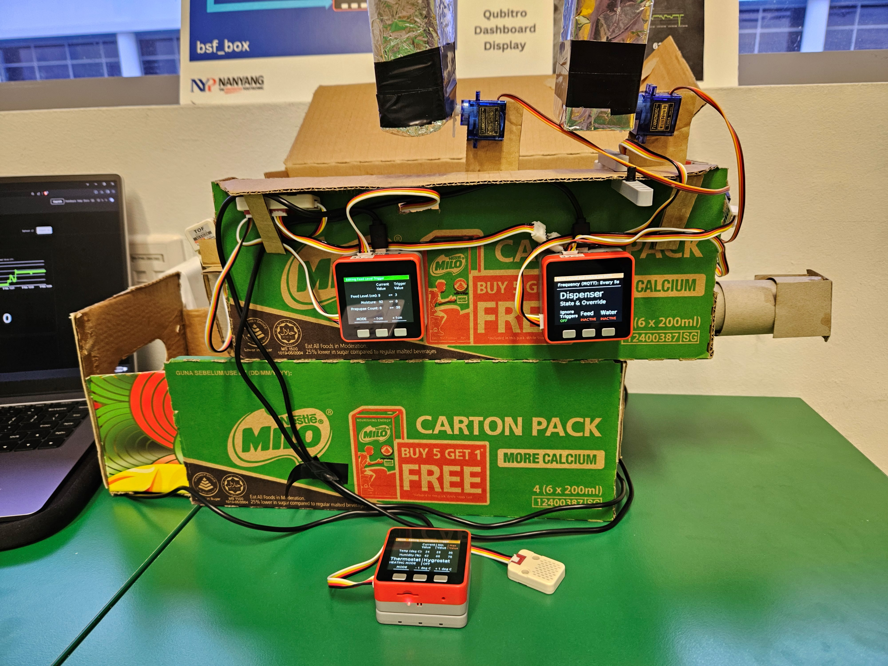
  
Front view of Black Soldier Fly box prototype.

  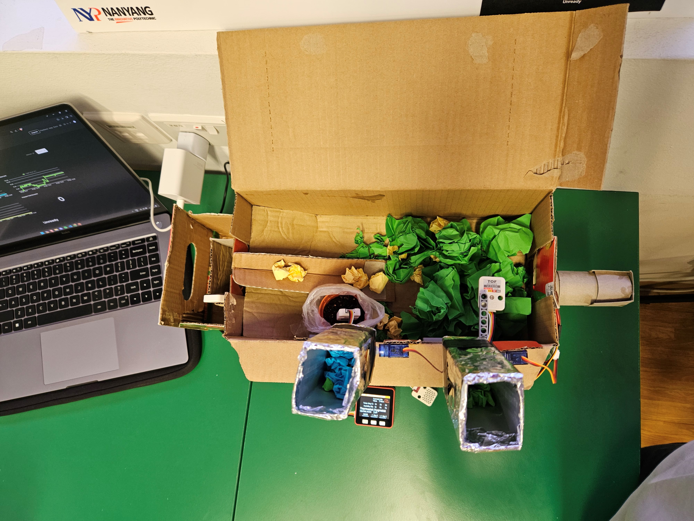
  
Top view of Black Soldier Fly box prototype. (Green balls: soil, Yellow balls: food, Blue balls: water)

  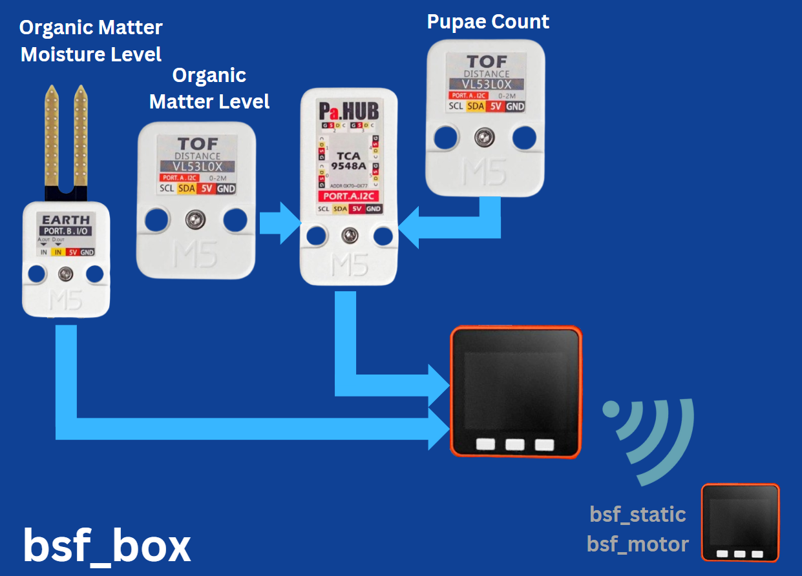
  

    Block diagram of M5Stack FIRE for Black Soldier Fly box. <a class="inline" href="bsf_box_flowchart.png" target="_blank">Link to detailed flowchart</a>
  

  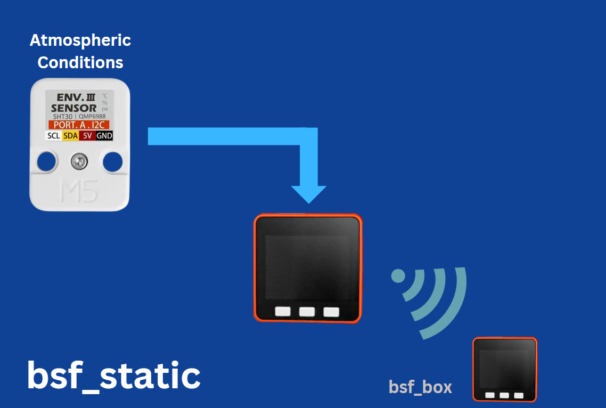
  

    Block diagram of M5Stack FIRE for atmospheric conditions controller. <a class="inline" href="bsf_static_flowchart.png" target="_blank">Link to detailed flowchart</a>
  

  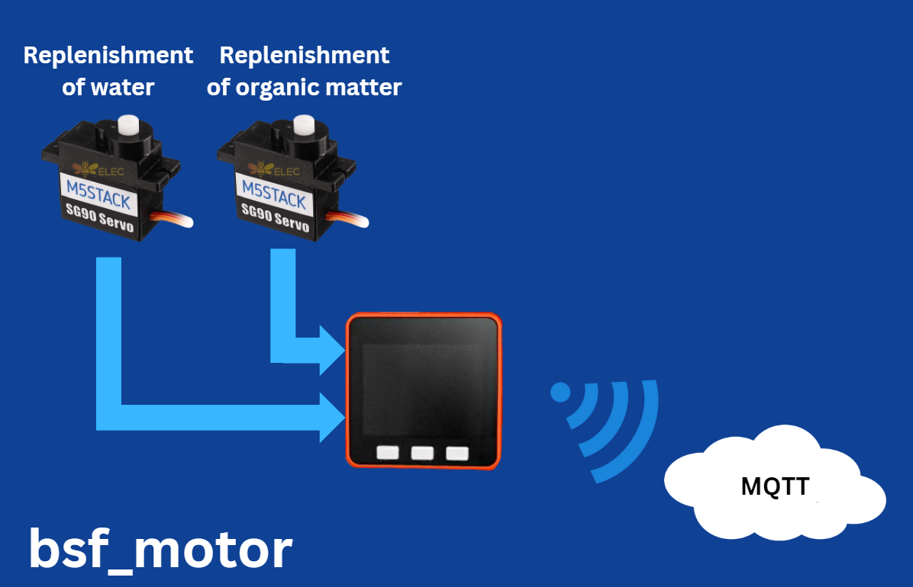
  

    Block diagram of M5Stack FIRE for automatic feeding and watering. <a class="inline" href="bsf_motor_flowchart.png" target="_blank">Link to flowchart</a>
  

### Dashboard

  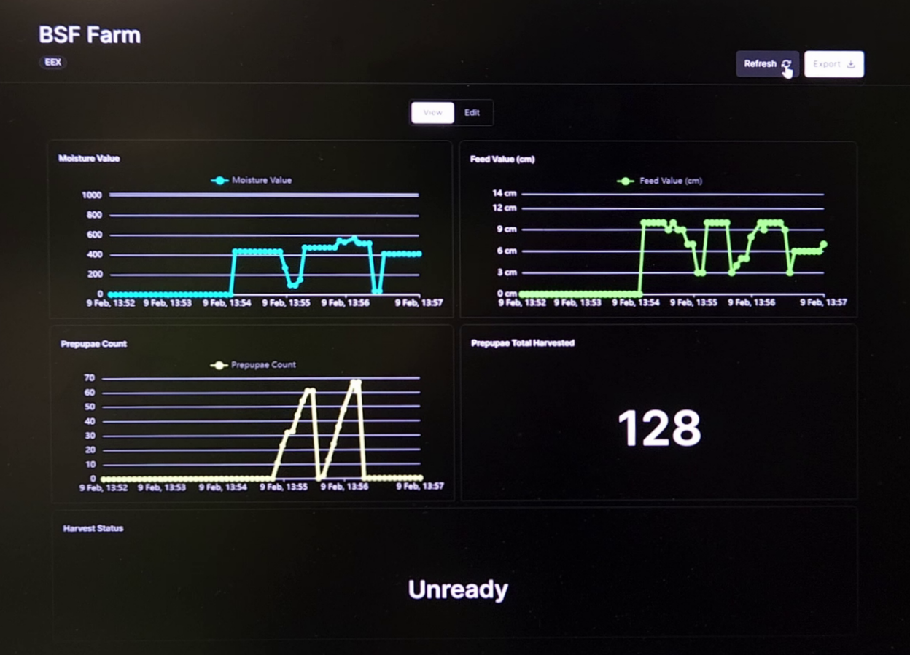
  
Dashboard for viewing environmental conditions, prepupae count, and harvest status.

## Full Development Journey
The project was part of an NYP module called the “Engineering Exploration Project”. It required my team to create a solution based on this driving question:
> How can we design a sustainable technology solution in retail, urban farming, smart factory or healthy lifestyle?

### My role
My team opted for designing a solution in urban farming, as it seemed the most interesting at that time and would allow us to showcase our skillset. After lots of research, we found a workable topic on insect farming, and went ahead with it.

In the end, I would be in charge of programming the embedded devices, ensuring that they could read sensor data, actuate motors and communicate with each other and the online dashboard.

### Embedded device and modules
The embedded devices provided were [M5Stack FIREs](https://docs.m5stack.com/en/core/fire), equipped with an ESP32-WROVER-E module which has an Xtensa dual-core LX6 microprocessor running up to 240 MHz. The [UIFlow IDE](https://m5stack.com/uiflow) was used to program the M5Stacks wirelessly, and we were to use [Blockly](https://developers.google.com/blockly).

  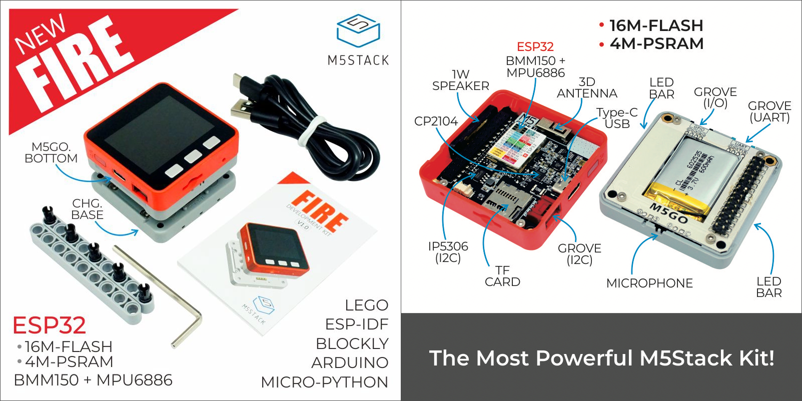
  
Promotional material for the M5Stack FIRE.

  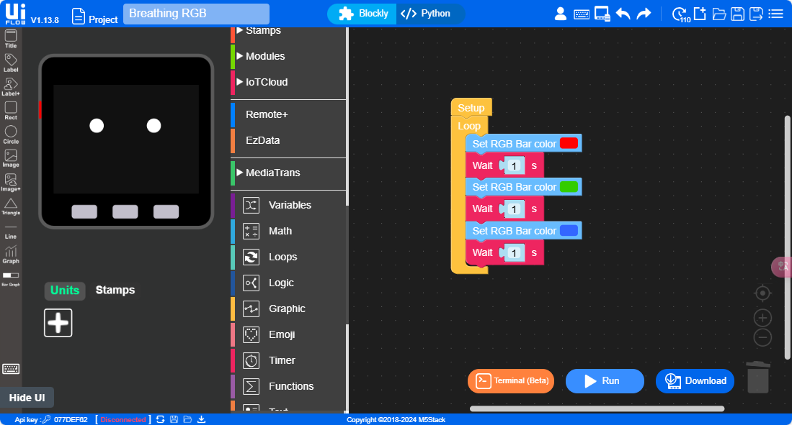
  
UIFlow's implementation of Blockly, a visual programming tool supporting drag and drop.

UIFlow was adequate for simpler projects such as the one shown above (cycling through colours on the LED bar), even for handling a few additional inputs and outputs. However, it proved troublesome when it came to trying to code more complex programs, especially when trying to create a more advanced user interface (which you will see why later).

M5Stack provides an ecosystem of modules for its development kits, from sensors to actuators which can be easily connected using widely available 4-pin Grove cables. Additionally, M5Stack provides drivers for most of its Grove-connected sensors, making it plug and play and incredibly easy to protoype.

  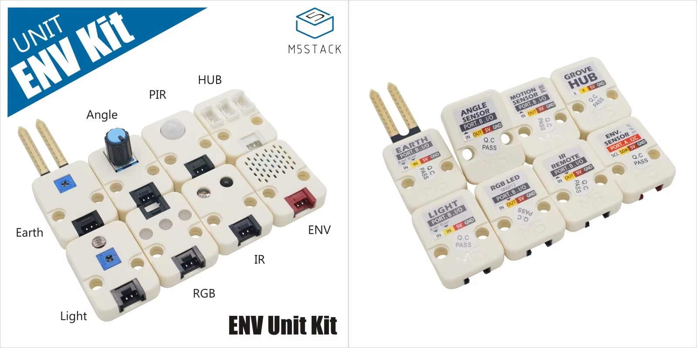
  
The M5Stack Environment Units Pack Kit, which we were provided with as options for use.

### The solution
The idea was to take current insect farm solutions but automate most of the tedious manual labour, and optimise the conditions for insect reproduction and growth. We started with a box design which we found easily scalable, as shown below, and iterated on it:

  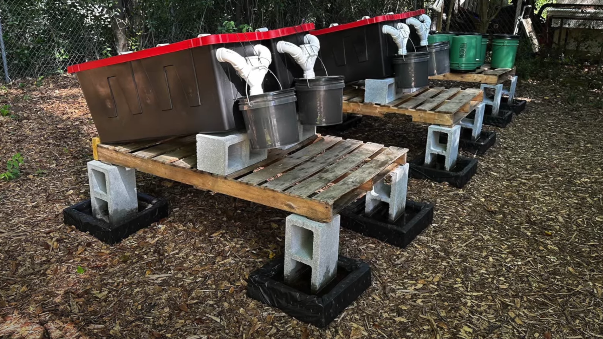
  

    Image credit: <a class="inline" href="https://www.youtube.com/watch?v=sKFH-FYCSSg" target="_blank">Acorn Land Labs: "How to make Infinite FREE Animal Feed"</a>
  

  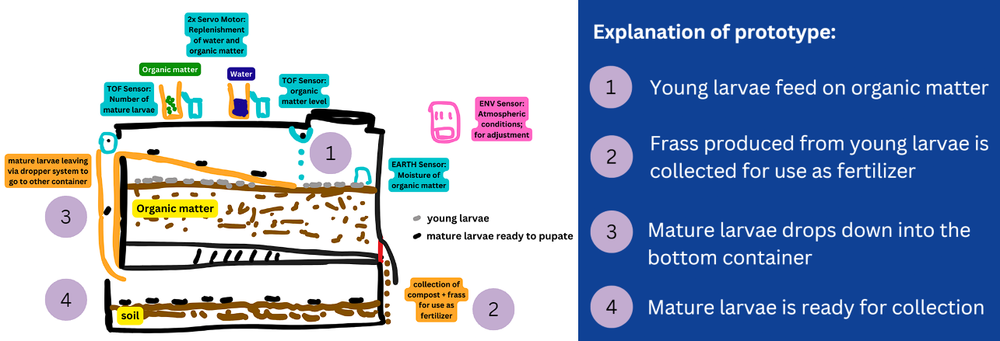
  
Cutaway sketch of the prototype and explanation of its functions.

The compact and stackable design of the boxes made urban farming Black Soldier Flies very viable, provided that the area could be climate controlled. Additionally, automation meant less labour required, making farming them more economical and thus more viable as well.

#### The reason for BSFs
Many different insects can be farmed and consumed. The most common ones that people have probably heard of by now are crickets and mealworms, and less commonly, ants and beetles. However, research brought us to the Black Soldier Fly, which has already shown tremendous potential.

**Black Soldier Flies:**
- Have a high protein content[^1]
- Are not a vector of disease[^1]
- Feed on a variety of organic material[^2]
- Do not consume anything but water in the adult stage[^2]
- Do not bite or sting[^2]
- Its larvae has an outstanding capacity in reducing waste volumes rapidly[^3]

[^1]: https://www.mdpi.com/2071-1050/12/11/4567
[^2]: https://www.ncbi.nlm.nih.gov/pmc/articles/PMC5664030

  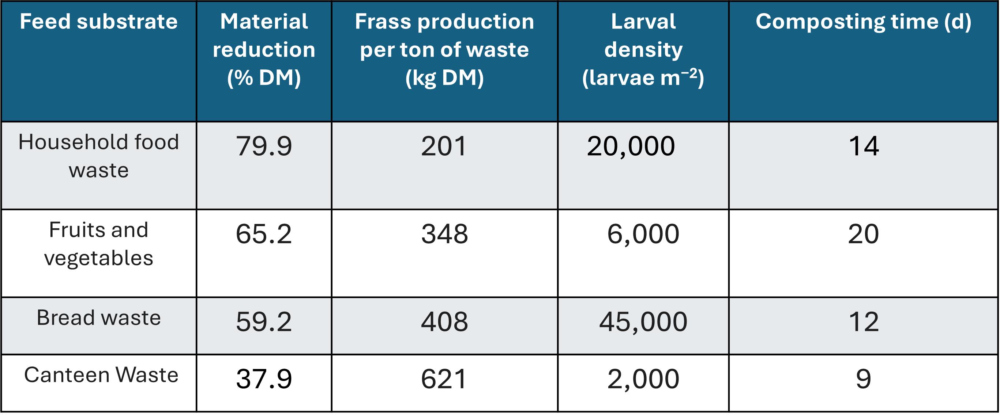
  
Black Soldier Flies excel at consuming organic waste!

With all decisions, there is a tradeoff: Black Soldier Flies are not typically eaten whole like other insects due to their harder exoskeletons, compared to insects like crickets or mealworms, making them slightly less versatile. However, they can still be ground down into powder to provide protein, and can then be incorporated into foods such as protein bars, baked goods, pasta, and snacks.

### Programming the M5Stack FIREs

  <iframe
    src="https://www.youtube.com/embed/7CZHJPPcxUY"
    class="absolute top-0 left-0 w-full h-full"
    frameborder="0"
    allow="accelerometer; autoplay; clipboard-write; encrypted-media; gyroscope; picture-in-picture"
    allowfullscreen
  ></iframe>

  <iframe
    src="https://www.youtube.com/embed/6861dDwTGro"
    class="absolute top-0 left-0 w-full h-full"
    frameborder="0"
    allow="accelerometer; autoplay; clipboard-write; encrypted-media; gyroscope; picture-in-picture"
    allowfullscreen
  ></iframe>

